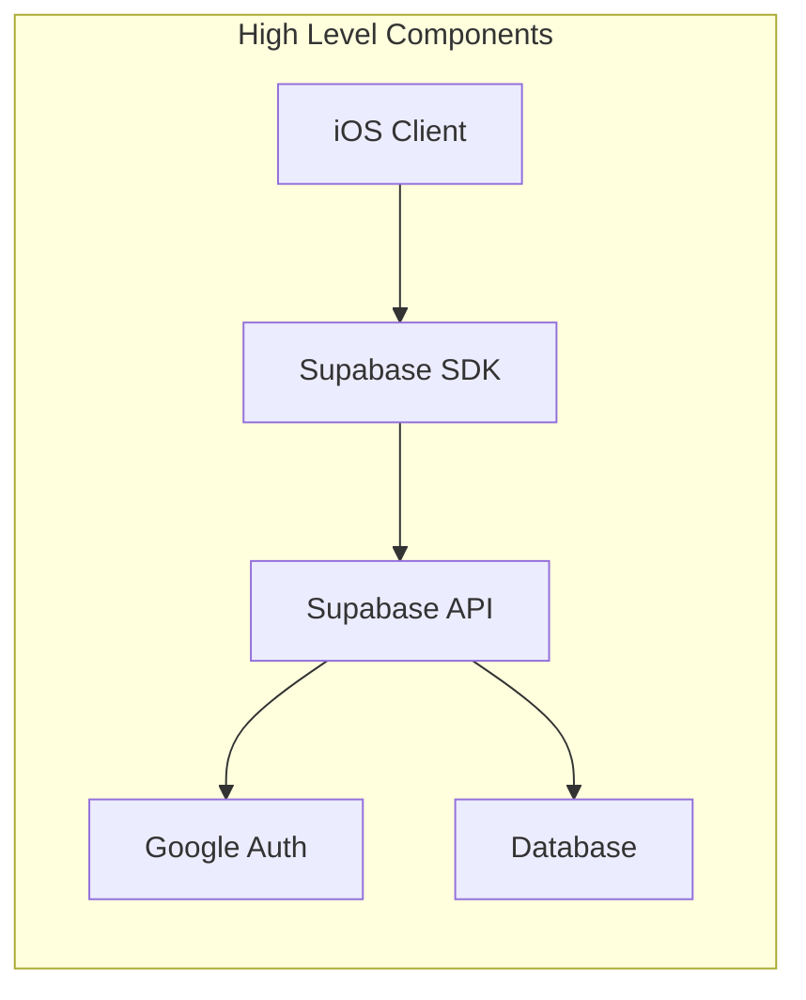
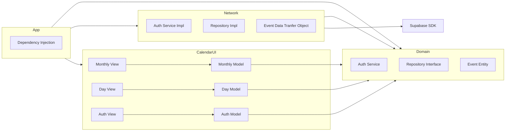
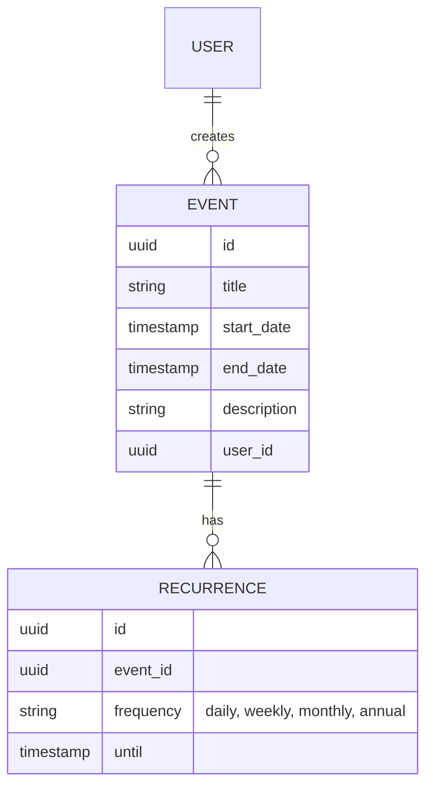
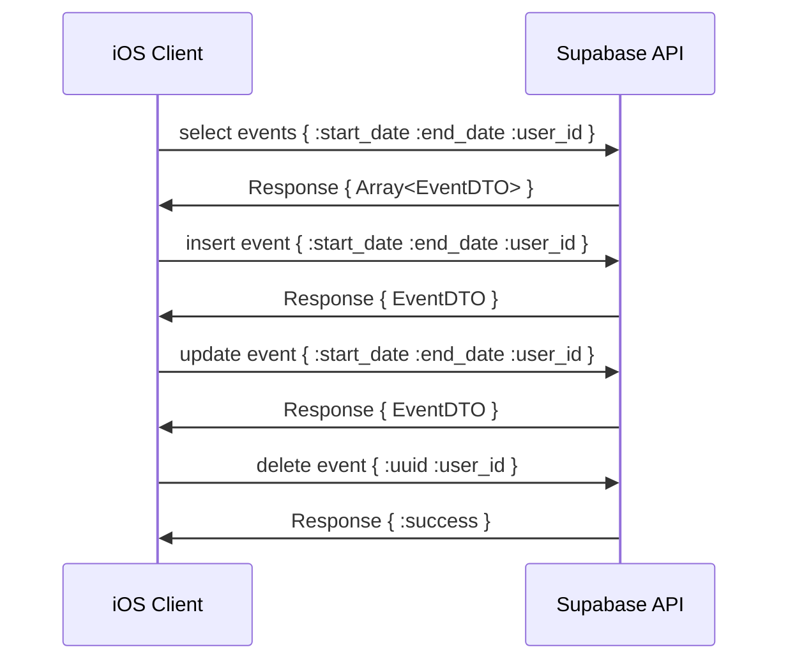
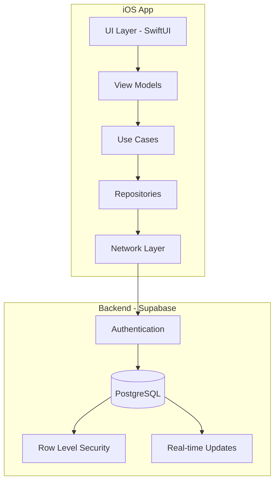
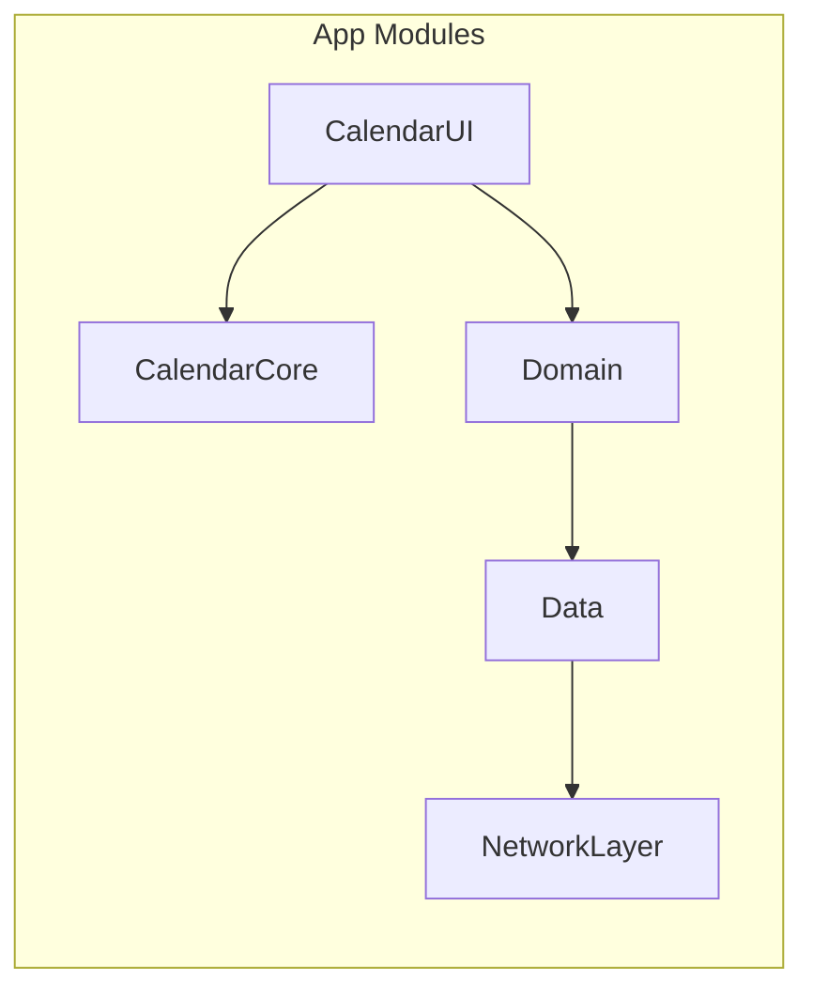
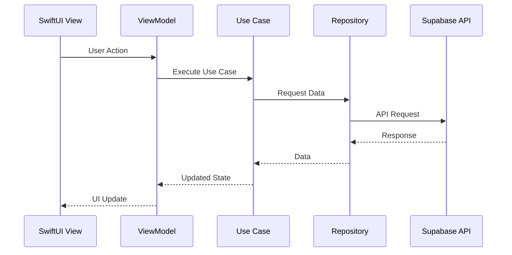
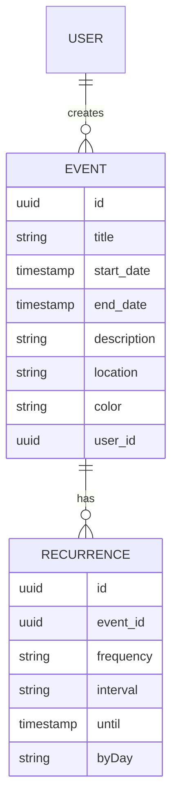

# Infinite Calendar

A high-performance iOS calendar application featuring vertical infinite scroll and iCal-compliant event management.

## Requirements

### Functional Requirements:

- User should be able to login using Google Authentication
- User should be able to create an event
- User should be able to create a recurring event
- User should be able to see calendar in a day and monthly view
- Monthly view should implement smooth vertical scroll

### Non-Functional Requirements:
- Use pagination/infinite scroll for the monthly view
- Data should be loaded from the backend on start only
- Offline mode is not supported

## Infrastructure Diagram



## Frontent Design


## Data Model


## API



## System Architecture



## Module Structure


## Project Structure
```
Calendar/
├── App/
│   └── CalendarApp.swift
├── Features/
│   ├── Calendar/
│   │   ├── UI/
│   │   ├── ViewModels/
│   │   └── Models/
│   ├── Events/
│   │   ├── UI/
│   │   ├── ViewModels/
│   │   └── Models/
│   └── Auth/
│       ├── UI/
│       ├── ViewModels/
│       └── Models/
├── Core/
│   ├── Domain/
│   │   ├── Entities/
│   │   ├── UseCases/
│   │   └── Repositories/
│   └── Data/
│       ├── Repositories/
│       ├── DataSources/
│       └── DTOs/
├── Infrastructure/
│   ├── Network/
│   ├── Storage/
│   └── DI/
└── Resources/
    ├── Assets/
    └── Localization/
```

## Data Flow


## Event Data Model


## Configuration Management

The app uses environment-specific configuration files for managing secrets and environment variables:

```plaintext
ios/Sources/CalendarCore/Resources/
├── Config.development.plist.template
├── Config.staging.plist.template
└── Config.production.plist.template
```

### Setup

1. Copy the template files and remove the `.template` extension
2. Update the values in each environment file
3. Files are gitignored to prevent committing sensitive data

### Usage

The configuration is managed through `AppConfig` in CalendarCore module and automatically loads the correct environment based on build configuration:
- DEBUG builds use development configuration
- RELEASE builds use production configuration

### Adding New Configuration

Add new keys to the template files and update the `AppConfig` struct in CalendarCore module.